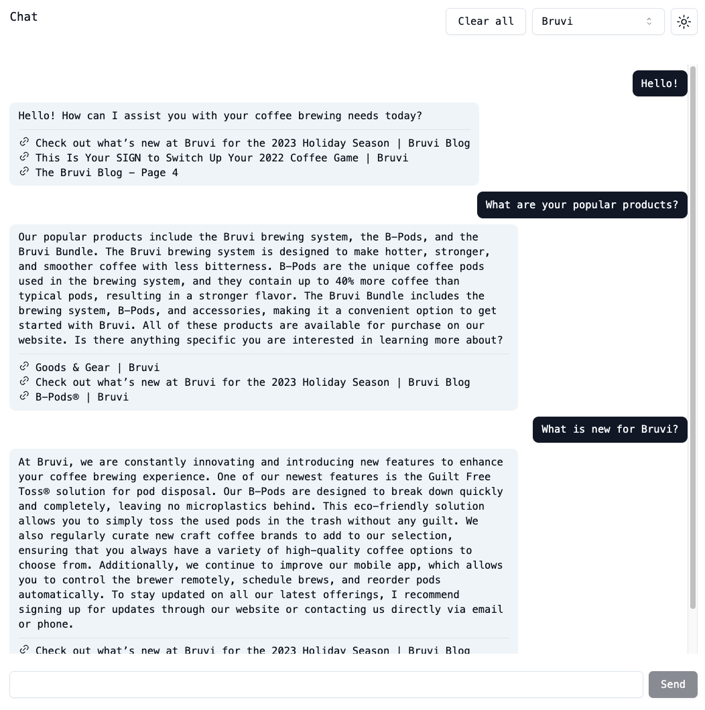

# Chatter

The <b>Chat</b>bot Star<b>ter</b> (with RAG). This project is a demo for a chatbot with RAG functionality. The chatbot will act as George, a virtual sales agent for a coffee machine brand Bruvi to answer the user's questions with references to the pages on Bruvi website.

The project also allows to switch the model to different sources with UI: `human`, `custom hosted model`, `OpenAI with RAG`.

## UI



## RAG diagram

The diagram below shows the flow of RAG. This repo only implements the online part. The offline part is in the [scrapy-demo](https://github.com/minfawang/scrapy-demo) repo.


## Tech stack

- [x] [Next.js](https://nextjs.org/) (Frontend, SSR)
- [x] [Supabase](https://supabase.com/) (Database, PubSub)
- [x] [FastAPI](https://fastapi.tiangolo.com/) (Backend)
- [x] [pipenv](https://pipenv.pypa.io/en/latest/) (Python virtual management)
- [x] [shadcn/ui](https://ui.shadcn.com/) (UI components, Tailwind CSS)

It uses numpy to build the in-memory "vector database" for RAG.

## Getting Started

### First time

Update `SUPABASE_PROJECT_URL` and `SUPABASE_ANON_KEY` in [supabase.tsx](app/supabase.tsx) if necessary.

Also, create `.env` file. See [.env.example](/.env.example) for an example.

### Dev

Run the backend server:

```bash
pipenv shell
cd api
uvicorn index:app --reload
```

Run the frontend development server:

```bash
npm run dev
```

Open [http://localhost:3000](http://localhost:3000) with your browser to see the result.
